# Imersão #5 - Gateway de Pagamento

O projeto consiste em:

Simular o processamento em tempo real de uma _gateway_ de pagamento, aonde o cliente envia uma solicitação com os dados de uma transação para serem validados pelo sistema: se validados, a transação é aprovada, caso contrário, a transação é rejeitada.

> Que problemas esse projeto poderia resolver em termos de negócio?
> O projeto pode ser adaptado para casos de uso onde é necessário visualizar o processamento de dados em tempo real. Por exemplo, em um painel de controle para o cliente final ou mesmo internamente por uma área de gestão para o controle de compras, vendas, etc.

Dentro da dinâmica do sistema:
1. Um cliente qualquer, digamos uma loja virtual, envia o pagamento para a _gateway_ de pagamento;
2. Uma requisição _REST_ é enviada para uma aplicação _backend_ _Nest.js_, que registra as ordens de pagamento;
3. Após registrar, a aplicação de _backend_ publica uma mensagem para o sistema de mensageria - o _Apache Kafka_;
4. Outra aplicação _Go_, então, consome a mensagem do _Kafka_ e realiza o processamento do pagamento;
5. O processador notifica o _backend_ via _Kafka_ para atualizar com o _status_ da transação - Aprovado/Rejeitado;
6. A aplicação de _frontend_ _Next.js_ apresenta o resultado na tela para o usuário.

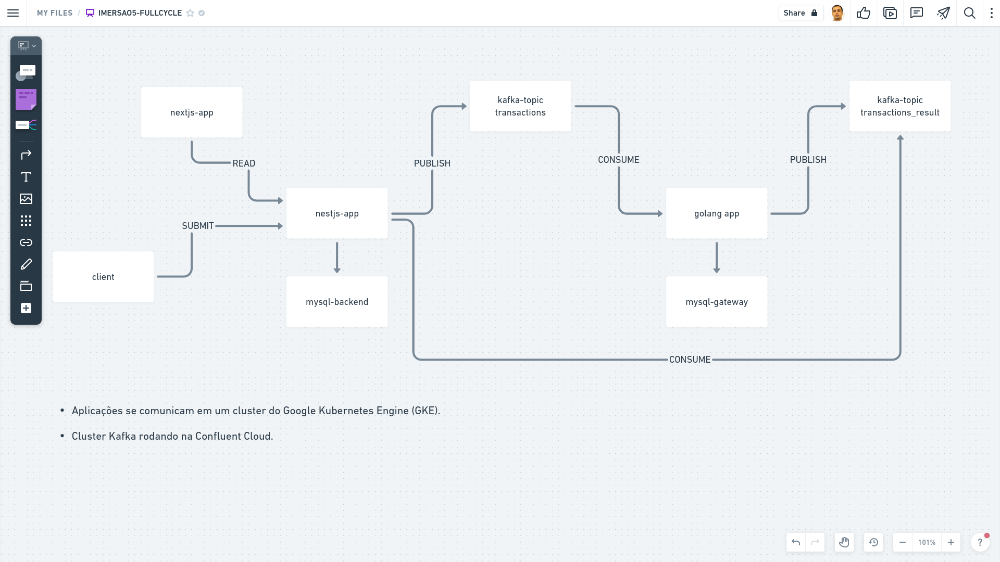

Nessa dinâmica, fica claro que a responsabilidade de receber transações é separada da responsabilidade de processá-las, já que um microsserviço específico realiza o processamento das transações.

Faz parte do projeto a criação de um painel de controle, desenvolvido em _Next.js_, onde é possível acompanhar as transações sendo processadas em tempo real, ou seja, as transações chegando e mudando de _status_ automaticamente.

Por se tratar de informações sensíveis referentes a uma ordem de pagamento, como garantir que esses dados não sejam perdidos? Nesse caso, opta-se pela utilização de um sistema de mensageria como estratégia de resiliência.

> Em termos de monitoramento, de forma a acompanhar métricas de negócio, como as transações de pagamentos, é possível fazer uso de uma solução como o _Prometheus_ vinculado ao processador _Go_, permitindo visualizar o resultado das métricas em _dashboards_ do _Grafana_.

#### Processador de Transações

A aplicação responsável pelo processamento das transações é desenvolvida em _Go_. E adota um _design_ de Arquitetura Hexagonal (_Ports and Adapters_) integrado a _Clean Architecture_.

A camada de domínio envolve algumas regras universais, que compreendem, por exemplo: valor mínimo e máximo de cada transação e validação dos dados do cartão de crédito.

A camada de _usecase_ aplica o fluxo de processamento da transação, inserindo os dados no banco de dados e publicando uma mensagem no tópico do _Kafka_ nos casos de transação aprovada e rejeitada.

Os adaptadores se integram à aplicação atuando para comunicá-la com o mundo externo: a plataforma _Kafka_ e os bancos de dados _MySql_ e _Sqlite_.

#### Aplicação Backend

A aplicação de _backend_ é construída com o famoso _framework_ _Node.js_: o _Nest.js_. A aplicação disponibiliza uma _API REST_ a ser consumida pelo cliente da _Gateway_ de Pagamentos (uma loja virtual, por exemplo).

Ela situa-se no início e no final do processo: recebe a solicitação para iniciar o pagamento, faz o registro da ordem de pagamento e, em seguida, envia o pagamento para processamento - ao publicar uma mensagem no _Kafka_ para o processador de transações consumir. Depois de processar a transação, o processador notifica o _Kafka_ com uma nova mensagem que é consumida pelo _backend_ para atualizar o _status_ do pagamento - rejeitado ou aprovado.

O _Nest.js_ oferece de forma nativa diversos mecanismos para comunicação entre sistemas, desde _gRPC_, _GraphQL_, _REST_ até os sistemas de mensageria, como o _RabbitMQ_, _Kafka_, etc. É convenção do _framework_ trabalhar conforme uma arquitetura _MVC_ (_Model-View-Controller_): _Model_ representando regras de negócio, persistência; _Controllers_ recebendo as requisições, acessando a camada de negócio (_Model_) e devolvendo uma resposta _HTTP_, ou seja, no papel de intermediador. E as _Views_, neste caso, retornando no formato _JSON_.

A aplicação conta com outro recurso para lidar com a lógica de pagamentos: a conta. Todo pagamento fica ligado a uma conta. Na tabela _Account_, há uma coluna _token_ gerando um valor padrão para cada conta. Então, no momento de criação de uma nova ordem de pagamento, é passado, no _header_ da requisição, o valor do _token_. Isso funciona como um mecanismo de autenticação também. Somente com esse _token_ (_secret_) é possível consultar as ordens de pagamento ou criar ou realizar qualquer operação. Assim, só é possível executar uma ação que esteja associada a uma conta.

#### Aplicação Frontend

A aplicação de _frontend_ funciona como um painel de controle e é construída a partir do _Next.js_, _framework_ _React_ que trabalha com outras estratégias de renderização, como a de _Server-Side Rendering_ (_SSR_). Por padrão, o _React_ trabalha com _Client-Side Rendering_ (_CSR_), mas isso pode gerar algumas desvantagens, como _memory leaks_, por exemplo. Não se recomenda usar _CSR_ para _SEO_ (_Search Engine Optimization_) também, porque o buscador considera que a aplicação contém uma única página: a do arquivo _HTML_.

Outra funcionalidade que o _Next.js_ oferece são as _API Routes_.

Talvez fosse necessário criar uma aplicação de _backend_ separada só para acessar recursos específicos de _backend_, como banco de dados. Mas, com _API Routes_, não é mais necessário, porque a _API_ de _backend_, que seria construída fora, fica dentro da própria aplicação _React_.

Isso proporciona alguns benefícios, porque funciona de forma similar a um _API Gateway_: ao invés de fazer a chamada direta para a _API_ de _backend_, a própria aplicação de _frontend_ (_Next.js_) chama sua própria _API_ que, então, envia a requisição para a aplicação de _backend_ (_Nest.js_).

Dessa forma, fica tudo centralizado na própria aplicação de _frontend_, tornando possível melhorar o tratamento de erros e adicionando uma lógica própria na _API Route_. A _API Route_ de ordem de pagamento, por exemplo, extrai os dados da conta a partir de um _cookie_ que é descriptografado com o uso do _iron-session_.

> Apenas como nota, o _iron-session_ é um utilitário de sessão _stateless_ do _NodeJS_ que utiliza _cookies_ assinados e criptografados para armazenar dados.

Caso os dados da conta não sejam válidos, significa que o usuário não está autenticado - ele é, então, redirecionado para a página de _login_. Mas, caso os dados sejam válidos, a aplicação segue fazendo a requisição para a _API_ _Nest.js_, passando o _token_ extraído a partir do _cookie_.

A aplicação dispõe de uma funcionalidade para prover uma experiência de tempo real, a partir da biblioteca _SWR_. Desssa forma, ela fica atualizando de tempos em tempos as ordens de pagamento que está exibindo na listagem. É utilizado um _hook_ do _SWR_ - o _useSWR_ - parametrizado com um _refreshInterval_ de 2 segundos para realizar as chamadas de consulta das ordens de pagamento para o _backend_.

### Execução

1. #### Criar 1 cluster Kubernetes no GCP (Google Cloud Platform)

Por que optar pelo _Google_ como _Cloud Provider_? A decisão pelo _GKE_ (_Google Kubernetes Engine_) se dá, principalmente, porque corresponde a um dos principais serviços de _Kubernetes_ na nuvem.

Para fins didáticos e por se tratar de um projeto de escopo mais reduzido, é criado 1 _cluster_ contendo 2 _nodes_ (nós ou máquinas) apenas.

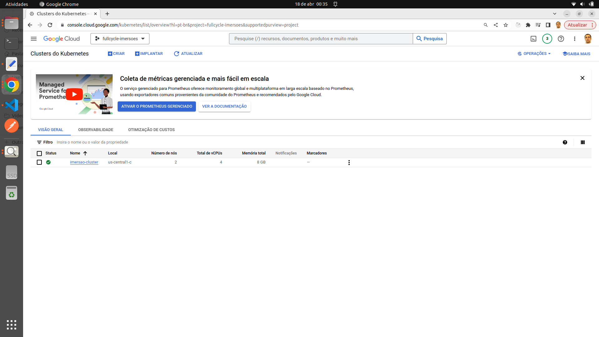

2. #### Criar 1 cluster Kafka na Confluent Cloud.

Entre as opções de criação, é definido que o _cluster_ vai estar rodando no _Google Cloud_, já que o provedor do _Kubernetes_ é o próprio _Google Cloud_.

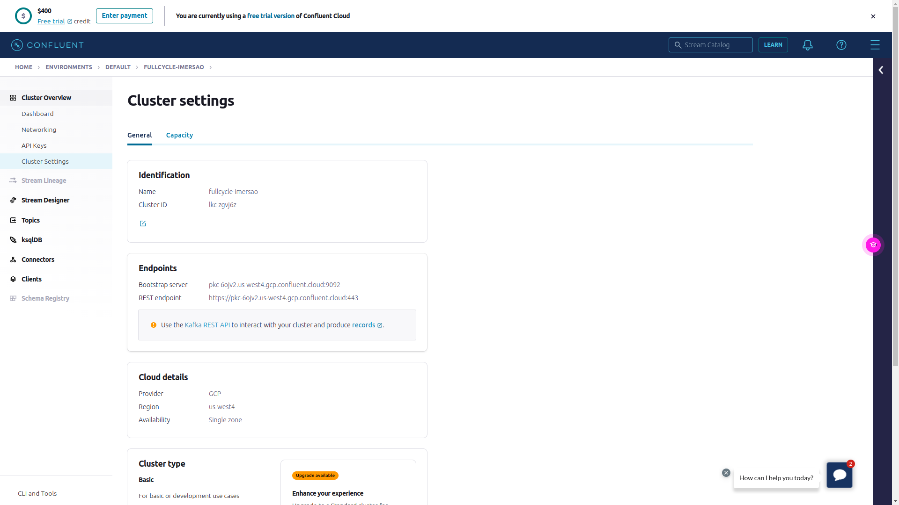

Para conectar no cluster _Kubernetes_, é necessário, antes, ter instalado o _gcloud_ na máquina local. O _glcloud_ é um _client_ do _Google Cloud_.

3. #### A partir do Painel do GCP (Kubernetes Engine / Clusters), é possível copiar o comando que vai conectar ao cluster Kubernetes:

```
gcloud container clusters get-credentials imersao-cluster --zone us-central1-c --project fullcycle-imersoes
```

4. #### Após conectar, rodar um comando simples, que verifica as máquinas contidas no cluster, apenas para confirmar que ingressamos no cluster:

```
kubectl get nodes
```

5. #### Instalação MySQL

Uma recomendação usual que, de forma geral, é seguida no mercado, é a de que não se deve utilizar banco de dados dentro de um _cluster_ _Kubernetes_. Principalmente, porque banco de dados é um mecanismo sensível, exigindo diversas configurações e alta velocidade, portanto, não é comum se ver bancos de dados rodando junto a clusters _Kubernetes_ em projetos críticos. Assim, o _MySQL_ é instalado no _cluster_ _Kubernetes_ mais para fins didáticos, para mostrar a funcionalidade de _Helm Charts_.

_Helm Charts_ são como pacotes de manifestos do _Kubernetes_, que configuram diversos tipos de aplicações. Um _chart_ funciona de modo semelhante a uma receita de bolo: quando instalado, executa diversas ações que deixam as aplicação prontas para uso.

A _Bitnami_ é bem conhecida por disponibilizar _Helm Charts_ para _Kubernetes_. A documentação de _Helm Chart_ do _MySQL_ (https://bitnami.com/stack/mysql/helm), provê os comandos para adicionar o repositório da _Bitnami_ na máquina local e para instalar configurações padrões do _MySQL_ no cluster _Kubernetes_. A partir do comando de instalação _Helm_, são produzidas algumas informações no terminal, que podem ser aproveitadas para conectar no _MySQL_.

São criadas 2 bases de dados: _gateway_ (microsserviço _Go_) e _backend_ (microsserviço _Nest.js_).

6. #### Deploy da aplicação Go

Após aplicar os manifestos (em _k8s/golang_), como saber que a aplicação em _Go_, a partir do cluster _Kubernetes_ GKE, está se comunicando com o _cluster_ _Kafka_ na _Confluent Cloud_?

A partir do Painel da _Confluent_, em _Topics_ / _transactions_ / _Messages_, clicar em _Produce a new message to this topic_ e em _Produce_:

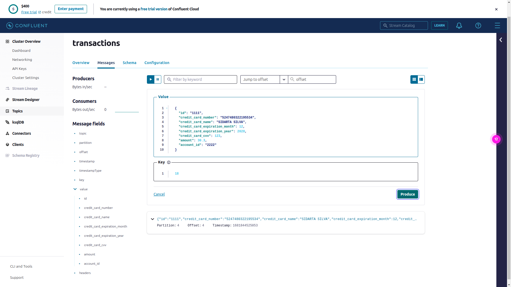

Em _Topics_ / _transactions_result_ / _Messages_ / no _offset_ 0 da partição 0, retornou a mensagem:

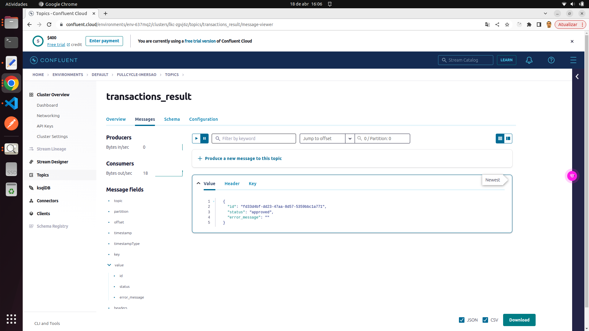

E os dados foram gravados no banco de dados?

```
select * from transactions;

+------+------------+--------+----------+---------------+---------------------+---------------------+
| id   | account_id | amount | status   | error_message | created_at          | updated_at          |
+------+------------+--------+----------+---------------+---------------------+---------------------+
| 1111 | 2222       |   30.3 | approved |               | 2023-04-17 17:16:15 | 2023-04-17 17:16:15 |
+------+------------+--------+----------+---------------+---------------------+---------------------+
```

Quer dizer que sim, está funcionando - 1. A aplicação _Go_ consumiu a mensagem do _Kafka_; 2. Processou as informações e gravou os dados no _MySQL_; 3. E, por fim, publicou outra mensagem no _Kafka_.

7. #### Deploy da aplicação Nest.js

Após aplicar os manifestos (em _k8s/nestjs_), vamos trabalhar com o _External IP_ do _Load Balancer_ para acessar a aplicação na _Internet_?

```
kubectl get svc

NAME                        TYPE           CLUSTER-IP     EXTERNAL-IP     PORT(S)        AGE
backend                     LoadBalancer   10.100.13.94   34.172.44.107   80:31046/TCP   77m
```

Não. Pode-se registrar um novo _DNS_ a partir de um serviço de registro de domínios. Neste caso: `backend.imersao5.sidartaoss.com`.

Neste momento, é necessário criar uma nova conta para obter um novo _token_. A partir desse _token_ (_secret_), é possível logar no painel de controle da aplicação _Next.js_ e também solicitar a criação de uma nova ordem de pagamento.

Na raiz do projeto (em _nestjs_), enviar a requisição a partir do arquivo _accounts.http_:

```
Request

POST http://backend.imersao5.sidartaoss.com/accounts
Content-Type: application/json

{
    "name": "conta 1"
}
```

É retornado o _response_:

```
Response

HTTP/1.1 201 Created
X-Powered-By: Express
Access-Control-Allow-Origin: *
Content-Type: application/json; charset=utf-8
Content-Length: 164
ETag: W/"a4-PA3mQHZtyy5tGr3reMp0nMq4q6w"
Date: Mon, 17 Apr 2023 18:43:52 GMT
Connection: close

{
  "id": "76ddc600-b9b9-4c44-85cd-bcb0a061b02c",
  "token": "hvc2yoabori",
  "name": "conta 1",
  "updated_at": "2023-04-17T18:43:52.498Z",
  "created_at": "2023-04-17T18:43:52.498Z"
}
```

Enviar a requisição a partir do arquivo _orders.http_:

```
Request

POST http://backend.imersao5.sidartaoss.com/orders
Content-Type: application/json
x-token: hvc2yoabori

{
    "credit_card_number": "4344585832209743",
    "credit_card_name": "Test0 Test",
    "credit_card_expiration_month": 12,
    "credit_card_expiration_year": 2028,
    "credit_card_cvv": 122,
    "amount": 33.6
}
```

É retornado o _response_:

```
Response

HTTP/1.1 201 Created
X-Powered-By: Express
Access-Control-Allow-Origin: *
Content-Type: application/json; charset=utf-8
Content-Length: 282
ETag: W/"11a-mPXeqhpiywziL/PGi2+D/cPoVgE"
Date: Mon, 17 Apr 2023 18:47:06 GMT
Connection: close

{
  "id": "5c3ffed7-3744-46d0-9d1c-d1a0d6175d35",
  "status": "pending",
  "credit_card_number": "4344585832209743",
  "credit_card_name": "Test0 Test",
  "amount": 33.6,
  "account_id": "76ddc600-b9b9-4c44-85cd-bcb0a061b02c",
  "updated_at": "2023-04-17T18:47:06.068Z",
  "created_at": "2023-04-17T18:47:06.068Z"
}
```

A ordem foi criada com o _status_ Pendente. Mas, no momento em que fica Pendente, já, na seqüência, é processada pela aplicação _Go_, que notifica a aplicação _Nest.js_ pelo _Kafka_ para atualizar o status de Aprovado/Rejeitado.

E como verificar o _status_, então?

Enviar a requisição a partir do arquivo de _orders.http_:

```
Request

GET http://backend.imersao5.sidartaoss.com/orders/5c3ffed7-3744-46d0-9d1c-d1a0d6175d35
x-token: hvc2yoabori
```

É retornado o _response_:

```
Response

HTTP/1.1 200 OK
X-Powered-By: Express
Access-Control-Allow-Origin: *
Content-Type: application/json; charset=utf-8
Content-Length: 286
ETag: W/"11e-fzF7Oe1p15YBZ42fSn7d2D5xVzw"
Date: Mon, 17 Apr 2023 18:51:37 GMT
Connection: close

{
  "id": "5c3ffed7-3744-46d0-9d1c-d1a0d6175d35",
  "amount": "33.60",
  "credit_card_number": "4344585832209743",
  "credit_card_name": "Test0 Test",
  "status": "approved",
  "account_id": "76ddc600-b9b9-4c44-85cd-bcb0a061b02c",
  "created_at": "2023-04-17T18:47:06.000Z",
  "updated_at": "2023-04-17T18:47:07.000Z"
}
```

8. #### Deploy da aplicação Next.js

Da mesma forma que com a aplicação _Nest.js_, após aplicar os manifestos (_k8s/nextjs_), registramos um novo _DNS_: `frontend.imersao5.sidartaoss.com`.

Para acessar a aplicação: http://frontend.imersao5.sidartaoss.com/login.

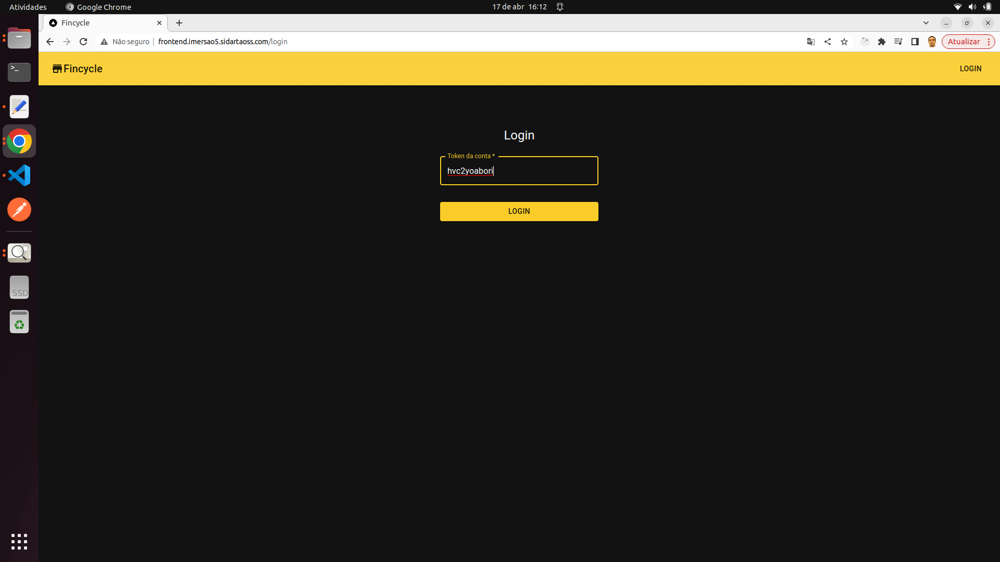

Ao clicar em _Login_, informando o _token_ (_secret_), a aplicação redireciona para a listagem de ordens de pagamento.

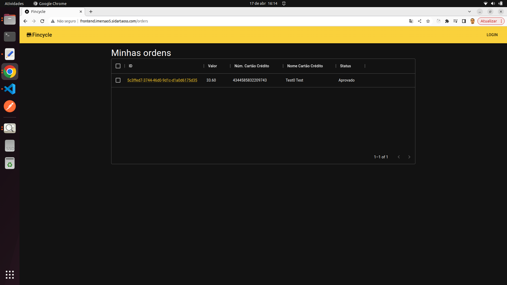

Para ver os detalhes da ordem de pagamento, basta clicar no _link_ do _ID_.

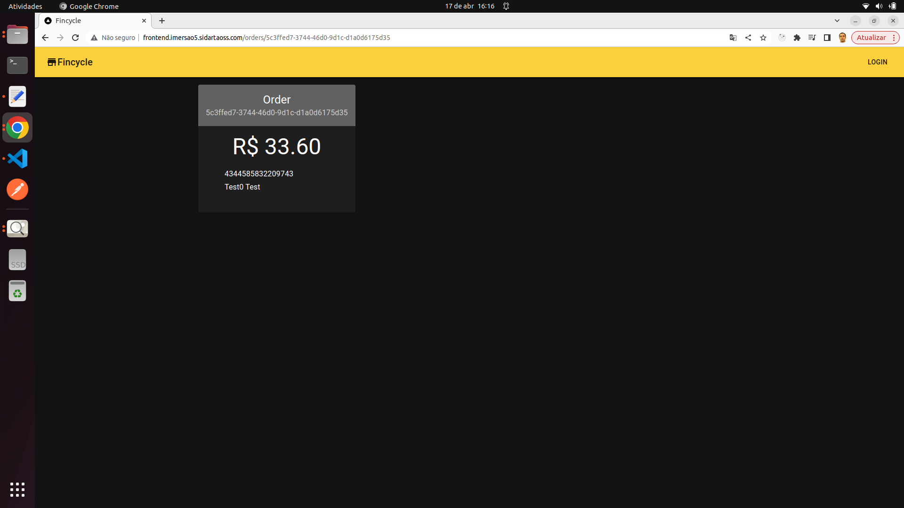

9. #### Acompanhar o processamento em tempo real

Ao logar no painel de controle, a aplicação redireciona para a listagem de ordens de pagamento.

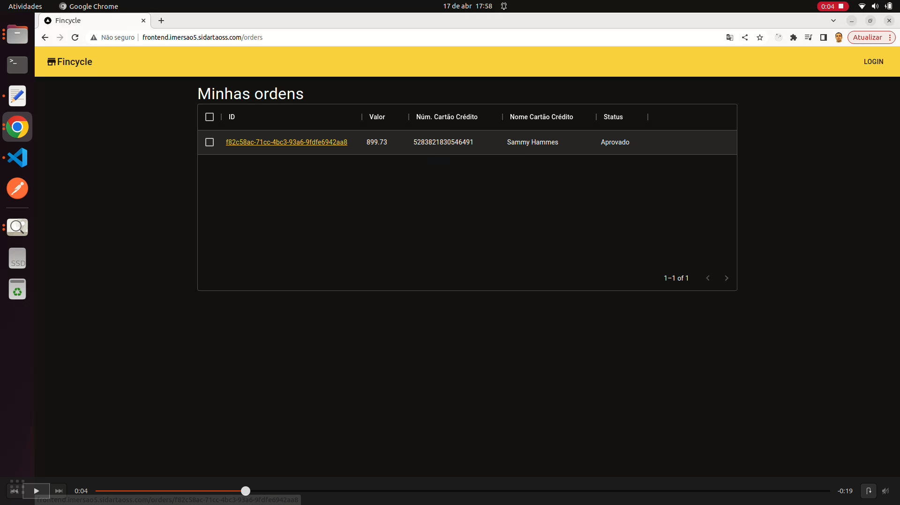

Enviar a requisição para criar uma nova ordem de pagamento a partir do arquivo _orders.http_:

```
Request

POST http://backend.imersao5.sidartaoss.com/orders
Content-Type: application/json
x-token: hvc2yoabori

{
    "credit_card_number": "5268185503303427",
    "credit_card_name": "Iris Marks",
    "credit_card_expiration_month": 8,
    "credit_card_expiration_year": 2027,
    "credit_card_cvv": 228,
    "amount": 884.93
}
```

A listagem é atualizada com um novo registro de ordem de pagamento, apresentando o _status_ como Pendente.

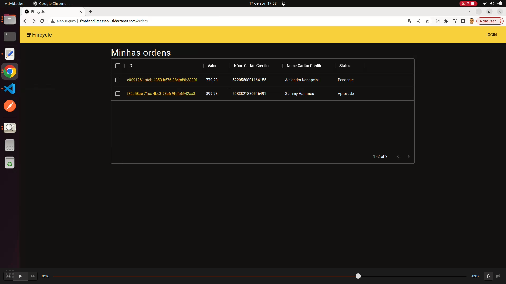

A ordem de pagamento é, automaticamente, atualizada com o _status_ Aprovado logo em seguida.

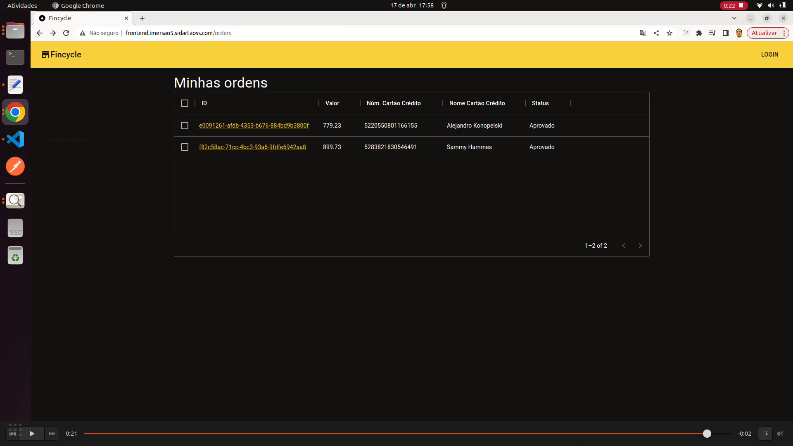

Lembrando a ordem de processamento:

1. A requisição chega no _Nest.js_;
2. O _Nest.js_ envia pelo _Kafka_ para o processador (_Go_);
3. O processador consome, processa e retorna pelo _Kafka_ para o _Nest.js_;
4. O _Next.js_ fica fazendo _pulling_ a cada 2 segundos (isto é, consulta os dados no _Nest.js_) e apresenta o resultado.
